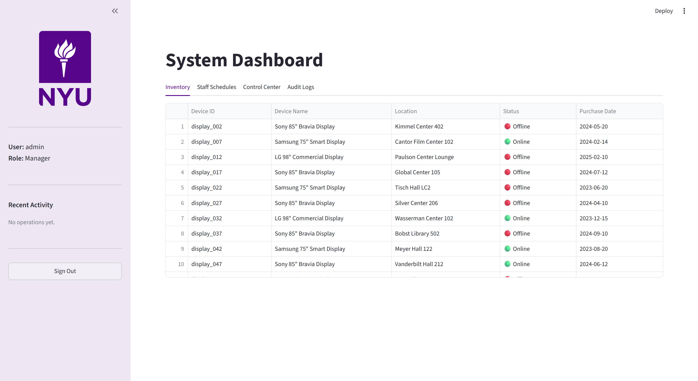
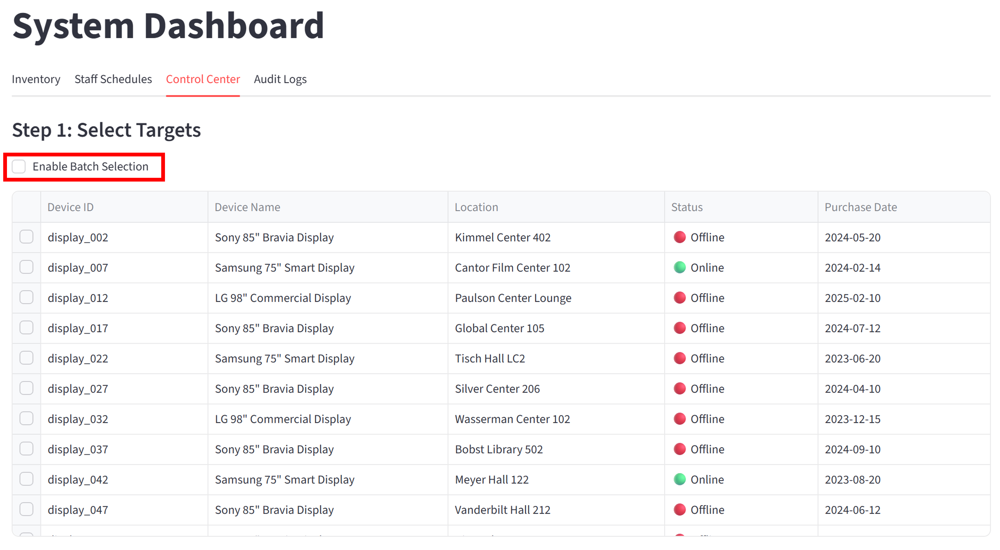
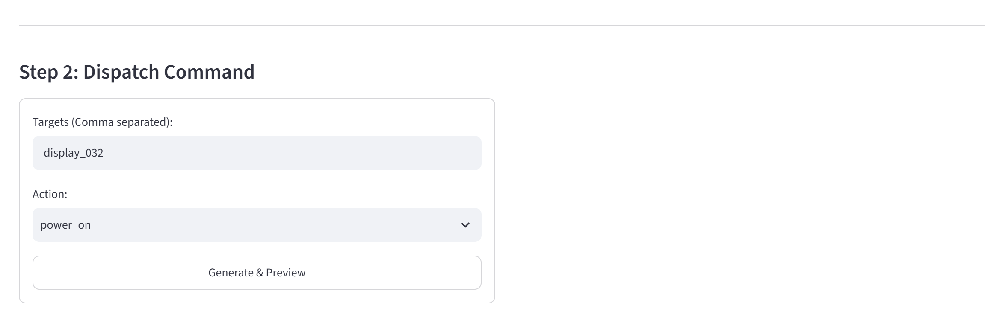
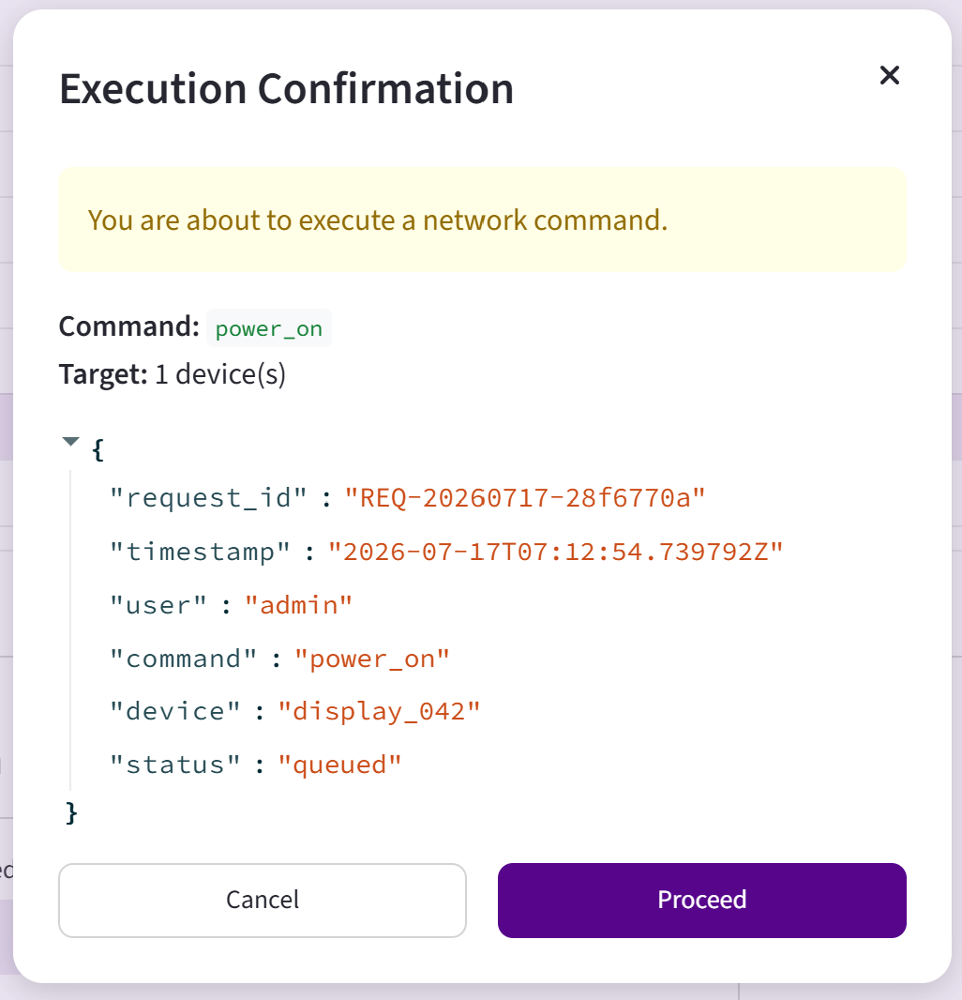
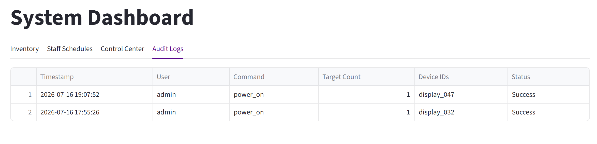
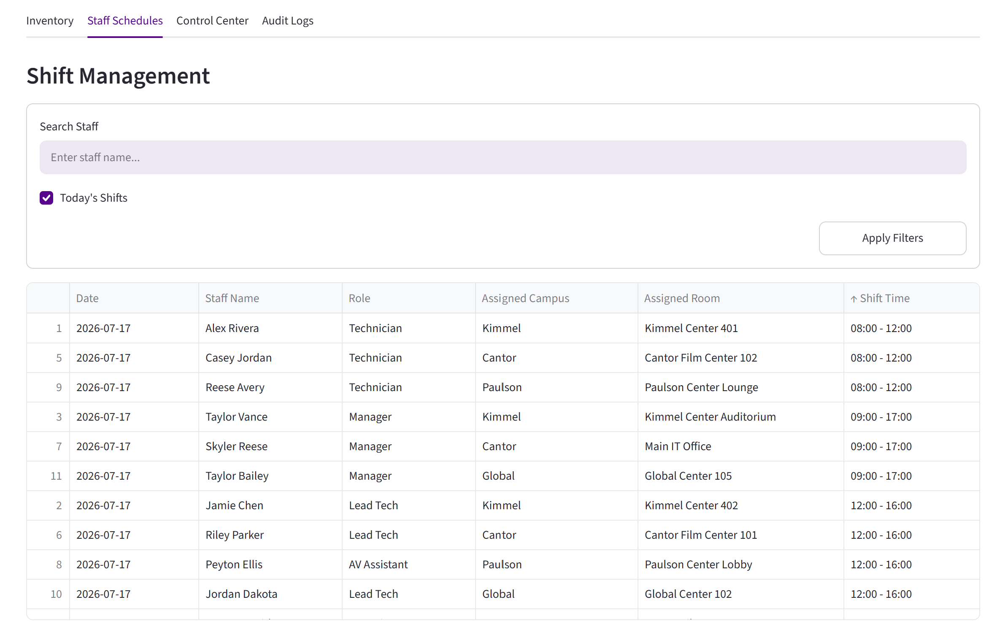
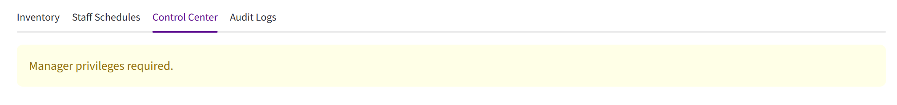

# NYU AV Operations Portal

> A Streamlit-based sample application demonstrating spreadsheet integration,
> role-based access control (RBAC), and JSON-based AV device command simulation.

**Built with:** Python · Streamlit · Pandas



## Overview
This project is a [Streamlit](streamlit.io)-based dashboard, developed as a sample application for the NYU Cloud and API Automation Developer position.

The application combines AV equipment inventory and staff schedules into a unified interface with Role-Based Access Control (RBAC), simulated device commands, and JSON payload generation.

## Features

- 🔐 User Authentication
- 👥 Role-Based Access Control (RBAC)
- 📦 AV Equipment Inventory Dashboard
- 📅 Staff Schedule Dashboard
- 🔍 Search & Sort Data
- 🎛 Device Command Simulation
- 📄 JSON Payload Generation
- ⬇ JSON Payload Download
- 📝 Audit Logging

## Project Structure
```text
.
├── app.py
├── requirements.txt
├── README.md
├── av_inventory.csv
├── staff_schedules.csv
├── audit_log.csv
├── screenshots/
└── .streamlit/
    ├── config.toml
    └── secrets.example.toml
```

## Installation
Install all required packages for this project with the following command:

```bash
pip install -r requirements.txt
```

## Configuration
Create `.streamlit/secrets.toml` with the following structure:

```toml
[usrs.MANAGER username here]
psw = "your password here"
is_admin = true

[usrs.TECHNICIAN username here]
psw = "your password here"
is_admin = false

```
A template is named `secrets.example.toml` and is provided in the repository.

`config.toml` sets the Theme color for this project.

## Run
Run the application:

```bash
streamlit run app.py
```

## How to Test
### Manager

1. Login with Manager username & password.
2. Open **Control Center**.
3. Select one or more devices.
    1. To select multiple devices, enable **Batch Selection**.
    
    
    2. You can also enter device IDs manually.
    

4. Choose a command.
5. Click **Generate & Preview**.
6. Confirm execution.

7. View the generated JSON payload.
8. Check the Audit Logs.


#### JSON Payload Example
The generated JSON payload is displayed before command execution and can be downloaded after confirmation.

Sample downloaded JSON File:
```JSON
{
  "request_id": "REQ-20260717-1b14454c",
  "timestamp": "2026-07-17T07:21:23.428799Z",
  "user": "admin",
  "command": "power_on",
  "device": "display_037",
  "status": "queued"
}
```

### Technician

1. Login with a Technician account.
2. View Inventory and Staff Schedules.

3. Device Control is restricted.



## Notes

This application is intended for demonstration purposes only.

No real AV hardware is controlled.
No real staff names are used.

Sample data is included for demonstration purposes.